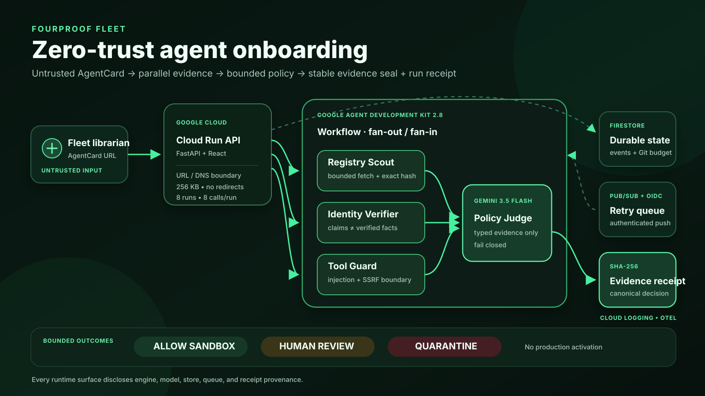

# FourProof Fleet

> Hire the agent. Not the risk.

FourProof Fleet is a zero-trust onboarding system for third-party AI agents. Its unlikely hero is the **AI fleet librarian**—often an operations coordinator, not a security engineer—who submits an AgentCard while three independent reviewers inspect discovery claims, identity evidence, and tool-safety boundaries in parallel. A final policy judge quarantines the agent, requests human review, or permits only an isolated sandbox. Every decision is sealed to a SHA-256 evidence receipt.



## Why this exists

Enterprise agent catalogs make agents easy to discover, but discovery metadata is still publisher-controlled input. An attractive card can hide prompt injection, private-network targets, missing identity, or instructions to exfiltrate credentials. FourProof Fleet intercepts that onboarding workflow before production tools or secrets are exposed.

The product is built for the **Fortified Enterprise Fleet** category of the All Things Agentic Hackathon.

### Operational before and after

| Without FourProof Fleet | With FourProof Fleet |
|---|---|
| An operations coordinator forwards the same untrusted AgentCard to several reviewers and manually reconciles incompatible notes. | One URL queues an asynchronous review and three independent Google ADK specialists inspect discovery, identity, and tool safety in parallel. |
| Publisher-controlled claims can drift between reviewers, leaving no exact record of what was inspected. | Every specialist shares one immutable, hashed snapshot; the final result includes a stable evidence-set hash and a separate run receipt. |
| A persuasive description can become an accidental production approval. | Code-enforced policy permits only isolated sandbox, human review, or quarantine; incomplete or contradictory evidence cannot activate production access. |

The autonomous action is the onboarding decision itself: the system collects evidence, applies bounded policy, persists the lifecycle state, and blocks an unsafe agent without requiring a security expert to steer each step.

## Judge it in 90 seconds

1. Open the [public demo](https://fourproof-fleet-7bow5ev35a-uc.a.run.app) and inspect the completed Gemini/ADK mission timeline, quarantine verdict, evidence-set hash, and decision receipt.
2. Open [`/health`](https://fourproof-fleet-7bow5ev35a-uc.a.run.app/health) to verify Cloud Run, Firestore, Pub/Sub, Gemini 3.5 Flash, Google ADK 2.8.0, bounded model calls, and current deployed Git SHA `8145025…`.
3. Compare the UI with the [sanitized cloud proof](docs/live-gcp-proof.json), which records the same mission id, seven stages, durable state, authenticated queue delivery, correlated logs, hashes, and the original proof executable `6c1c35c…`. The UI labels that provenance explicitly and retrieves the preserved Firestore mission read-only.
4. Review the [architecture diagram](docs/architecture.png), then run `npm run check` to reproduce 14 frontend tests, 45 backend tests, type checking, and the production build.
5. Watch the [continuous 3:01 demo](https://youtu.be/G2iZ4oLoTCE) for the Google Cloud console and end-to-end proof path.

## What the fleet does

1. **Registry Scout** fetches a bounded AgentCard and hashes the exact inspected bytes.
2. **Identity Verifier** separates declared owner/registry metadata from independently verified facts.
3. **Tool Guard** detects instruction override, secret-exfiltration language, tool coercion, role impersonation, credential-bearing URLs, localhost, and private-network targets.
4. **Policy Judge** combines the independent reports under a fail-closed policy.
5. **Receipt Sealer** produces a stable evidence-set hash, a run-specific canonical SHA-256 decision receipt, and a durable event stream.
6. **Lifecycle Recheck** links a later review to the previous mission while preserving the review cadence, stable evidence comparison, and receipt history across sessions.

The Google ADK workflow graph is a real fan-out/fan-in topology:

```text
START ─┬─> Registry Scout ───┐
       ├─> Identity Verifier ├─> Policy Judge ─> Evidence Receipt
       └─> Tool Guard ───────┘
```

## Google technology

- **Gemini 3.5 Flash** (`gemini-3.5-flash`) performs the specialist reviews and final policy judgment.
- **Google Agent Development Kit 2.8.0** provides the graph-based `Workflow`, typed agent outputs, tool boundaries, state, and runner.
- **Cloud Run** hosts the API and production frontend.
- **Firestore** persists missions, events, verdicts, and failure state across instances.
- **Pub/Sub** decouples intake from execution and retries failed missions. Push requests require a verified OIDC token from one configured service account.
- **Cloud Logging** receives structured Cloud Run runtime logs.
- **ADK OpenTelemetry instrumentation** creates spans around agent execution; the application also emits secret-free structured mission-stage logs correlated by mission id.

No Gemini or Google Cloud execution is claimed when credentials are absent. The public UI exposes `geminiConfigured`, runtime, store, queue, model, and framework through `/health`. Deterministic fixtures are labeled `deterministic_demo` and never represented as model output.

Deployed probes use `/health` because Cloud Run reserves some URL paths ending in `z`; `/healthz` remains a local compatibility alias only.

## Security boundary

- AgentCard content is data, never system instruction.
- Only `http` and `https` targets are accepted.
- URL credentials, loopback, link-local, private, reserved, multicast, and `.local` targets are blocked.
- DNS is resolved before a live fetch; any private result fails closed.
- Redirects are not followed and AgentCards are capped at 256 KB.
- No target receives a secret, cookie, API key, production credential, or production tool capability.
- Pub/Sub execution requests require Google-issued OIDC plus an exact service-account email and audience match.
- A code-level policy guard overrides any model attempt to allow an agent with injection, blocked endpoints, contradictory identity, or incomplete evidence.
- One immutable AgentCard snapshot is shared across all parallel reviewers, and its hash is part of the final receipt.
- The public deployment restricts live reviews to its controlled AgentCard host, atomically caps real Gemini missions per Git revision in Firestore, limits each mission to eight model calls and 2,048 output tokens per call, and bounds Cloud Run to one instance.
- Missing evidence produces human review or quarantine, never optimistic activation.

See [docs/threat-model.md](docs/threat-model.md) for attack cases and residual risks.

## Reproduce locally

Requirements:

- Node.js 22+
- Python 3.13+ (the current local verification used Python 3.14.6)
- npm 10+

```bash
python3 -m venv .venv
.venv/bin/python -m pip install -r backend/requirements.txt
npm ci
npm run check
npm run build
PYTHONPATH=backend STATIC_DIR=dist .venv/bin/uvicorn app.main:app --host 127.0.0.1 --port 8876
```

Open `http://127.0.0.1:8876`.

The two embedded fixtures work without credentials and are explicitly labeled. A live external target requires Gemini configuration.

### Gemini API mode

```bash
export GOOGLE_API_KEY="your-api-key"
```

### Vertex AI mode

```bash
export GOOGLE_GENAI_USE_VERTEXAI="TRUE"
export GOOGLE_CLOUD_PROJECT="your-project-id"
export GOOGLE_CLOUD_LOCATION="global"
```

Never commit either an API key or application-default credential file.

## API

```bash
curl -sS -X POST http://127.0.0.1:8876/api/missions \
  -H 'Content-Type: application/json' \
  --data '{
    "target_url": "https://demo.fourproof.invalid/poisoned",
    "demo_case": "poisoned",
    "objective": "Decide whether this external agent may enter an isolated enterprise sandbox."
  }'
```

Poll `GET /api/missions/{mission_id}`. The poisoned fixture must finish with `quarantine`, four independent injection signals, a blocked loopback endpoint, and a 64-character receipt hash.

After a mission reaches a terminal state, `POST /api/missions/{mission_id}/recheck` queues a linked review. Unchanged AgentCard bytes produce the same `evidence_set_sha256`; the run-specific decision receipt can still change when Gemini's typed explanation changes. A changed live AgentCard produces a new evidence-set hash.

## Deploy to Google Cloud

The repository includes [scripts/deploy-gcp.sh](scripts/deploy-gcp.sh). It is intentionally not executed automatically because it creates billable cloud resources and IAM bindings. Review it, authenticate `gcloud`, select a billing-enabled project, then set every required `FOURPROOF_*` variable before running it. The script refuses an uncommitted worktree, disabled billing, invalid resource names, or a missing action-time authorization acknowledgement. `.gcloudignore` is an explicit allowlist containing only the Dockerfile, package/build metadata, frontend source, public AgentCards, architecture SVG, and backend runtime source; tests, local environments, proof scripts, and submission documents are not uploaded to Cloud Build.

```bash
export FOURPROOF_PROJECT_ID="your-billing-enabled-project"
export FOURPROOF_REGION="us-central1"
export FOURPROOF_SERVICE_NAME="fourproof-fleet"
export FOURPROOF_RUNTIME_SA="fourproof-fleet-runtime"
export FOURPROOF_HARD_COST_CAP_USD="your-approved-maximum"
export FOURPROOF_MAX_LIVE_MISSIONS="8"
export FOURPROOF_BILLABLE_ACTION_ACK="I_CONFIRM_USER_AUTHORIZED_BILLABLE_GCP_CHANGES"
npm run deploy:gcp
```

`FOURPROOF_HARD_COST_CAP_USD` records the applicant's authorization ceiling and must be at least USD 5 for the documented proof workload; Google Cloud billing does not provide a guaranteed automatic hard stop at that value. `FOURPROOF_MAX_LIVE_MISSIONS` must be exactly 8 and adds a Firestore-transactional, per-Git-revision ceiling for real Gemini missions. Each mission is separately bounded to eight model calls and 2,048 output tokens per call, while Cloud Run stays at one maximum instance. Review the calculation and important public-hosting caveat in [docs/cost-boundary.md](docs/cost-boundary.md). Do not set the acknowledgement unless the project owner has confirmed the exact project and cost boundary for that deployment attempt. The deployment stays private by default. Only after separate action-time authorization to publish the hosted demo, set:

```bash
export FOURPROOF_PUBLIC_DEMO_ACK="I_CONFIRM_USER_AUTHORIZED_PUBLIC_CLOUD_RUN_DEMO"
```

Without that second acknowledgement, the script configures the private service and grants only its runtime identity permission to receive Pub/Sub push requests.

The script configures Cloud Run, Firestore, Pub/Sub with OIDC push authentication, Vertex AI access, service identity, max instances, and scale-to-zero. After deployment, verify every item in [docs/cloud-proof-checklist.md](docs/cloud-proof-checklist.md) and record the Cloud Run console plus live mission in the demo video.

After an authorized deployment, [scripts/live_proof.py](scripts/live_proof.py) executes a poisoned mission, a safe counterexample, and a linked safe recheck. It fails unless the observed service is a ready `.run.app` revision built from the expected Git SHA with Firestore, Pub/Sub, Gemini 3.5 Flash, Google ADK 2.8.0, exact OIDC configuration, durable Firestore documents, correlated Cloud Logging entries, and a rejected forged push. It never enables an API or changes a cloud resource.

```bash
export FOURPROOF_LIVE_PROOF_ACK="I_CONFIRM_USER_AUTHORIZED_GCP_AND_GEMINI_USAGE"
python3 scripts/live_proof.py \
  --base-url="https://YOUR_SERVICE_URL" \
  --project-id="${FOURPROOF_PROJECT_ID}" \
  --region="${FOURPROOF_REGION}" \
  --service-name="${FOURPROOF_SERVICE_NAME}" \
  --runtime-service-account="${FOURPROOF_RUNTIME_SA}@${FOURPROOF_PROJECT_ID}.iam.gserviceaccount.com" \
  --expected-git-sha="$(git rev-parse HEAD)" \
  --expected-live-mission-limit="${FOURPROOF_MAX_LIVE_MISSIONS}" \
  --output="docs/live-gcp-proof.json"
```

## Submission assets

- [submitted Devpost project copy](docs/submission-draft.md)
- [3:35 demo script](docs/demo-script.md)
- [top-five judging scorecard](docs/judging-scorecard.md)
- [architecture source](docs/architecture.svg) and [1600×900 PNG](docs/architecture.png)
- [1600×900 cover image](docs/cover.png)
- [threat model](docs/threat-model.md) and [live cloud proof checklist](docs/cloud-proof-checklist.md)
- [official Google Cloud cost model and deployment gates](docs/cost-boundary.md)
- [continuous recording runbook](docs/recording-runbook.md)
- [official requirements and submission evidence](docs/official-gates.md)

## Verification status

Verified locally and against the bounded Google Cloud deployment on 2026-08-31:

- 14 frontend/domain tests passed;
- 45 Python API/security/ADK graph/queue/live-proof tests passed;
- TypeScript production build passed;
- Python dependency consistency passed;
- browser QA loaded the public Cloud Run UI with zero console errors or warnings and verified the completed Gemini/ADK mission timeline, quarantine verdict, and separate evidence and decision hashes;
- the public page made only `GET /health` and `GET /api/missions/aa919f3a…` API requests during proof loading; no mission was created or model invoked;
- the 390 px mobile viewport had `clientWidth=390` and `scrollWidth=390`, with no horizontal overflow;
- the production-built UI ran the poisoned mission end to end and sealed a `quarantine` receipt;
- public commit `814502510979d7ea144aa395dec8948a6d2c9195` is served by Cloud Run revision `fourproof-fleet-00016-swp` at 100% traffic;
- one non-fixture Gemini 3.5 Flash / Google ADK mission originally ran on executable `6c1c35ce03138fc38b2ceaabb8188f6e31f6b59f` and completed with `quarantine`, durable Firestore state, Pub/Sub delivery, six correlated log entries, and separate evidence/decision hashes recorded in [`docs/live-gcp-proof.json`](docs/live-gcp-proof.json);
- the current revision's Git-bound live-budget document is absent and its `mission_stage` log query is empty, confirming this presentation update made zero new Gemini calls;
- the local final English video is 180.902667 seconds, 1920×1080 H.264/AAC, and passed full decode plus four-frame visual inspection;
- `npm audit` reported zero vulnerabilities.

Submission status:

- the final public video is available at [YouTube](https://youtu.be/G2iZ4oLoTCE);
- the project is submitted to the [All Things Agentic Hackathon on Devpost](https://devpost.com/software/fourproof-fleet);
- contest placement, award, and payment remain unverified.

## Contest-period disclosure

FourProof Fleet was created specifically for the All Things Agentic Hackathon during the contest submission period. Its Google ADK workflow, Gemini agent graph, mission API, prompt-injection guard, SSRF boundary, Firestore store, Pub/Sub/OIDC queue, receipt sealing, cloud deployment materials, and enterprise agent-onboarding flow were built for this entry.

Open-source libraries and Google services remain subject to their own licenses and terms. All claims above are tied to commands, code, or live observations.
