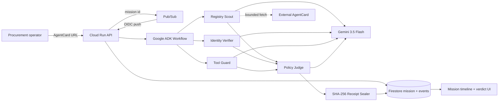

# Architecture and evidence flow


FourProof Fleet is a fail-closed review pipeline. Untrusted AgentCard content enters through one bounded fetcher; it never becomes a system prompt and it never receives credentials or production tools.



## State machine

```text
queued -> running -> completed
                  \-> failed
```

- Intake writes the complete queued mission before publishing it.
- Pub/Sub carries only the mission identifier; the worker reloads canonical input from Firestore.
- An atomic Firestore lease permits only one active delivery; an expired lease can be reclaimed after a worker crash.
- A terminal mission is idempotent: a duplicate delivery returns success without executing it twice.
- Every stage appends a timestamped event. The terminal record includes specialist reports, policy verdict, engine, model, a stable evidence-set hash, and a run-specific receipt hash.
- The same mission id correlates secret-free JSON stage logs in Cloud Logging with ADK's OpenTelemetry-instrumented execution.
- A terminal record stores `next_review_at`; a recheck creates a new mission linked by `previous_mission_id`, preserving cross-session lifecycle context.
- Any uncaught stage error is stored as `failed`; it is never converted into an activation decision.

## Fan-out / fan-in graph

Google ADK 2.8 `Workflow` owns the graph:

```text
START
  |-- registry_scout ------|
  |-- identity_verifier ---|--> policy_judge
  |-- tool_guard ----------|
```

The three specialists have independent typed outputs. The judge can only consume those validated structures. Its allowed decisions are:

- `allow_sandbox`: constrained test access only, never production activation;
- `human_review`: evidence is incomplete or ambiguous;
- `quarantine`: a blocking safety signal exists.

## Failure and retry behavior

- Queue publication failure changes the mission to `failed` and returns HTTP 503.
- Pub/Sub retries non-2xx worker responses according to its subscription policy.
- A configured push endpoint verifies Google OIDC issuer, audience, and exact service-account email.
- Firestore makes mission state durable across Cloud Run restarts and instance replacement.
- The deterministic fixtures are local demonstrations, not a cloud fallback. A non-fixture target without Gemini authentication returns HTTP 503.

## Trust boundaries

1. **Browser to Cloud Run:** validate JSON shape and a narrow URL contract.
2. **Cloud Run to target:** resolve DNS, reject non-public addresses, disable redirects, cap bytes, require JSON.
3. **Target content to Gemini:** expose content through tool responses, never instruction-template substitution; a non-model guard still enforces blocking policy.
4. **Pub/Sub to worker:** require Google-issued OIDC with audience and service-account binding.
5. **Decision to activation:** a receipt is an auditable recommendation, not permission to grant production credentials.
